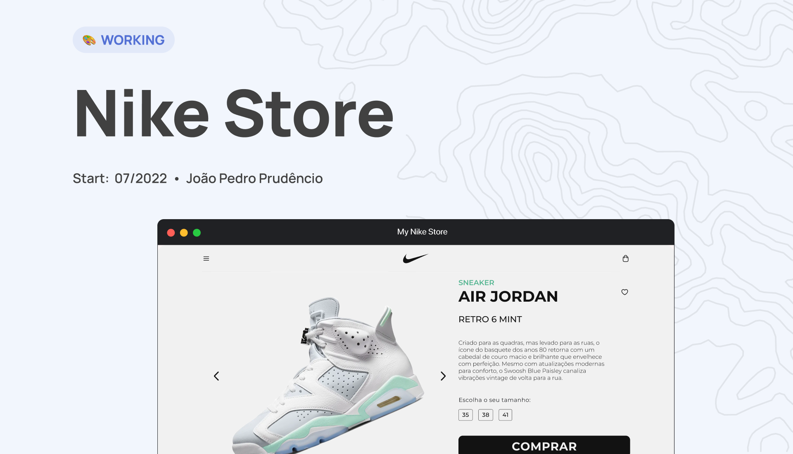

<h1 align="center">Nike Store 🤟</h1>

<p align="center">💅 Um projeto desenvolvido visando    <strong>aperfeiçoar</strong> conceitos relacionados ao Front-end 💙. <strong>Desenvolvido</strong> com <br> ReactJS, TypeScript, Styled Components, Eslint, Prettier, e mais.
</p>

<p align="center">
  <a href="#nike-store">
    
  </a>
</p>

## 🔮 Funcionalidades
- **Destaca-se**
  - 🔥 Desaclopagem de components
  - 🚀 Criação de `context` para evitar `prop drilling`
  - 🎉 Hook para troca de temas
  - 🍪 Mocks na criação do produto
- **Tecnologias**:
  - 🔥 ReactJS
  - 🌎 React Router DOM
  - 🧐 React Developer Tools
  - 💙 TypeScript
  - ✨ Styled-Components
  - 💫 Eslint / Prettier / EditorConfig / Commitlinter

## ⚙️ Instalação

Para inicializar o projeto localmente siga os passos descritos abaixo:

Primeiro, clone o repositório:
```
git clone https://github.com/jp-prud/Nike-Store.git
```

Acesse o repositório utilizando o seguinte comando
```
cd Nike-Store
```

Faça a intalação das dependências:
```
yarn install
```

Para executar a aplicação:
```
$ yarn start
```

## 💻 Aplicação

A aplicação está hospedada na plataforma da [Netlify](https://www.netlify.com/), clique [aqui](https://main--jp-nike-store.netlify.app/) para acessar.

## 🍻 Contato

Qualquer dúvida ou feedback estarei disponível em qualquer uma das redes sociais abaixo:


<div align="center">
  <a href="https://www.linkedin.com/in/jp-prud/" target="_blank"></a>
    <a href="mailto:jpprud.contato@gmail.com"></a>
</div>

<div align="center">
  <br>
 🚀 Never Stop Learning 🚀
</div>
